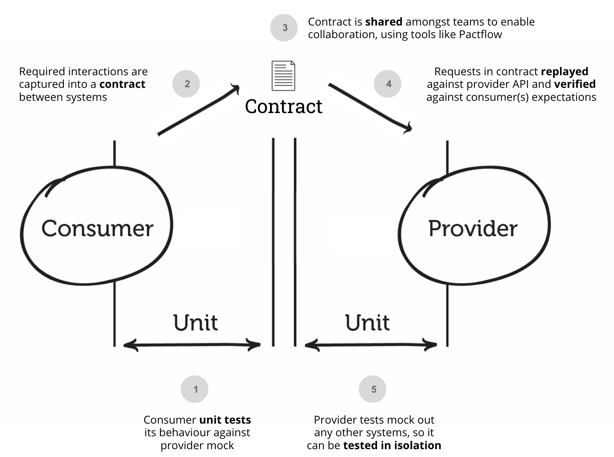

# Testy kontraktowe

* monolit vs serwisy
* back-end API + front-end
* wymiana informacji
* dokumentacja i testy niekoniecznie muszą oddawać rzeczywistość
* stosunkowo szybki feedback
* testowanie E2E jest czasochłonne i wymaga środowiska


---

# Consumer-Driven Contracts

* consumer vs provider
* kontrakt wychodzi od consumera, a nie od providera
* od razu widać **co jest rzeczywiście używane** i w jaki sposób
  * każdy consumer może mieć inne potrzeby
  * **BC breaks**

---

# Pact.io

* open-source
* biblioteki do większości języków (przydatne w architekturze serwisów)
* mock server
* pact broker (docker lub pactflow.io)
* matchers (`like`, `eachLike`, itp.)

Warto zobaczyć 5 krótkich odcinków [wprowadzenia wideo](https://www.youtube.com/watch?v=U05q0zJsKsU)

---



---

# Aplikacja testowa

https://github.com/EmilMassey/pact-tests

---

# Podstawowy przykład, z konfiguracją w pliku

* [consumer](https://github.com/EmilMassey/pact-tests/blob/main/src/Consumer/AddressClient.php)
  * [consumer test](https://github.com/EmilMassey/pact-tests/blob/main/tests/Consumer/AddressClientTest.php)
* [provider](https://github.com/EmilMassey/pact-tests/blob/main/src/Provider/index.php)
  * [provider states](https://github.com/EmilMassey/pact-tests/blob/f656c7579e6e7b2d6e7c05c4129d8b2bcb130abf/src/Provider/index.php#L60) 
  * [provider test](https://github.com/EmilMassey/pact-tests/blob/main/tests/Provider/PactVerificationTest.php)
  
---

# Użycie brokera (docker)

* mega istotny, kiedy wiele consumerów w różnych repozytoriach
* darmowy docker lub płatny, ale przyjaźniejszy i bogatszy pactflow.io
* wyraźnie widać problemy z kompatybilnością **jeszcze przed wypchnięciem**
* widać nad czym pracują zespoły odpowiedzialne za consumery
* pewien rodzaj dokumentacji *(IMO mało czytelna)*

Przykład: https://github.com/EmilMassey/pact-tests/tree/with-broker

---

# Wiele consumerów

https://github.com/EmilMassey/pact-tests/tree/multiple-consumers

```php
->setBody(
    $matcher->like([
        'firstname' => 'John',
        'lastname' => 'Doe',
    ])
);
```
```php
$matcher->like([
    'street' => 'lorem',
    'city' => 'ipsum',
    'postcode' => '00-000',
])
```

---


---

# Rozwój nowej wersji consumera

https://github.com/EmilMassey/pact-tests/commit/bcd5eb1670cc7f8dafbcae2267deffd6db37e8da#diff-4805fd2024844431593a78574d4e611acbe564c83758d9d2429808531ce411a0

Kompatybilność wsteczna


---

# Macierze


Provider jest uaktualniony => consumer może zostać wydany

---

# Kiedy to traci sens?

* kiedy to provider ustala potrzeby API, a nie consumer
* consumerzy i providerzy nie są stale rozwijani
* używamy wspólnych interfejsów w serwisach w celu zapewnienia zgodności (pact by tylko duplikował kontrakty wymuszane przez język programowania)
* wystarczą prostsze narzędzia, np. te, które weryfikują zgodność OpenApi z rzeczywistością
* chcemy testować zachowania, a nie samą zgodność z oczekiwaniami flow request-response - do tego są testy funckjonalne

---

# Odłożenie wdrożenia na później

* możemy zobaczyć w jaką stronę pójdzie aplikacja, ile zyskujemy
* wdrożenie w późniejszym etapie nie będzie raczej o wiele trudniejsze

